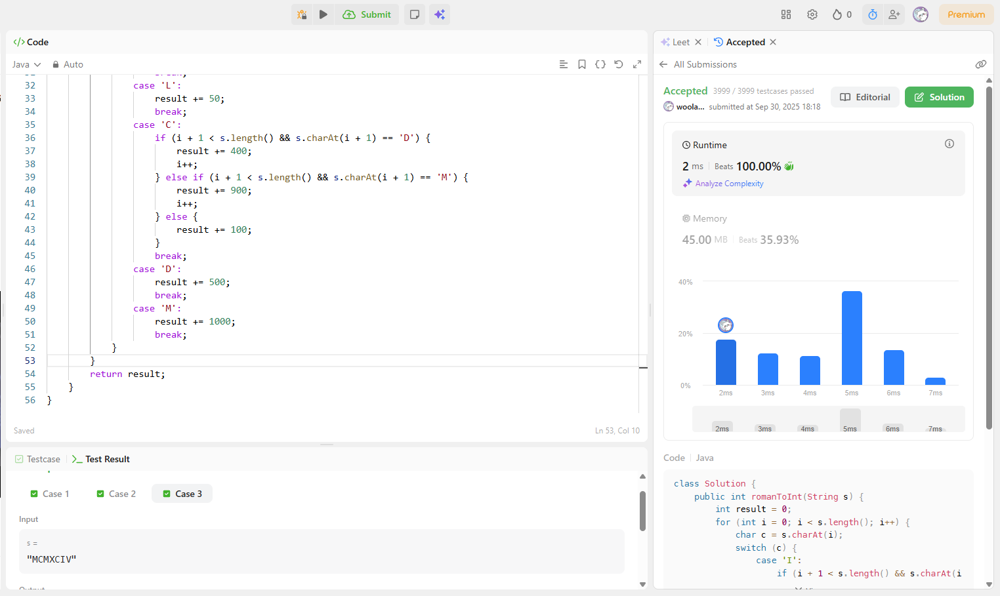
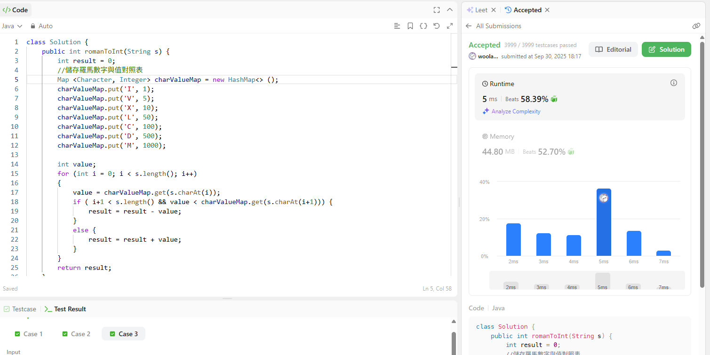

# 0013. Roman to Integer

## 題目連結
[LeetCode - Roman to Integer](https://leetcode.com/problems/roman-to-integer/description/)

## 題目描述
給定一個羅馬數字，將其轉換成整數。

| Symbol | Value |
|--------|-------|
| I      | 1     |
| V      | 5     |
| X      | 10    |
| L      | 50    |
| C      | 100   |
| D      | 500   |
| M      | 1000  |

## 自己的思路 MySolutions
- 思路一
  - 利用 switch case 查找每個數字，並確認 I、X、C 後有沒有 VX、LC、DM 來計算出 result。
- 思路二
  - 利用 Map 記錄羅馬字元與其值，迴圈跑每個字元，如果 當前 < 下一個字元 則先減去當前值。
## 思路一比對思路二
- 思路一：

- 思路二：

- Chatgpt 解釋：  
兩個解法時間複雜度都是 O(n)，但 HashMap 版本每一步的常數成本比 switch 大很多，get() 需要算 hash、定位 bucket、比對鍵；switch 直接編成 JVM 的 tableswitch/lookupSwitch 跳表，幾乎常數跳轉。

## 討論區大神思路 ElseSolutions
